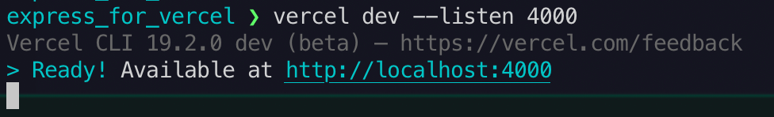

# README  
https://node-function-for-vercel.vercel.app/api/index.ts  

Vercel上で起動するAPIサーバー（サーバーレス関数）のテスト  

Next.jsでは`pages/api/`にコードを置き、Next.jsサーバを起動するとAPIも動作するが、  
素のAPIでは `api/`にコードを置き、*Vercel CLIでデプロイ先を指定した上で `vercel dev`を実行する*ことでローカル上でAPIサーバを起動させることができる。

[https://vercel.com/docs/v2/serverless-functions/introduction](https://vercel.com/docs/v2/serverless-functions/introduction)  
[https://vercel.com/blog/vercel-dev](https://vercel.com/blog/vercel-dev)    

注意点として、package.jsonのscriptで `dev` を登録し実行すると、vercel dev が再帰的に起動されてしまうためエラーとなる。 (Next.jsの場合は無問題)  
[https://github.com/vercel/vercel/blob/master/errors/now-dev-as-dev-script.md](https://github.com/vercel/vercel/blob/master/errors/now-dev-as-dev-script.md)

  

  

